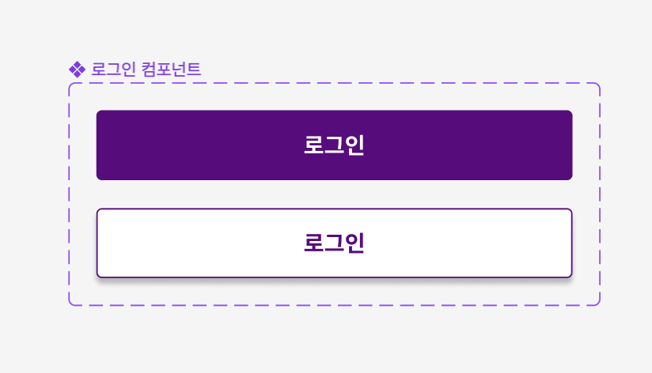
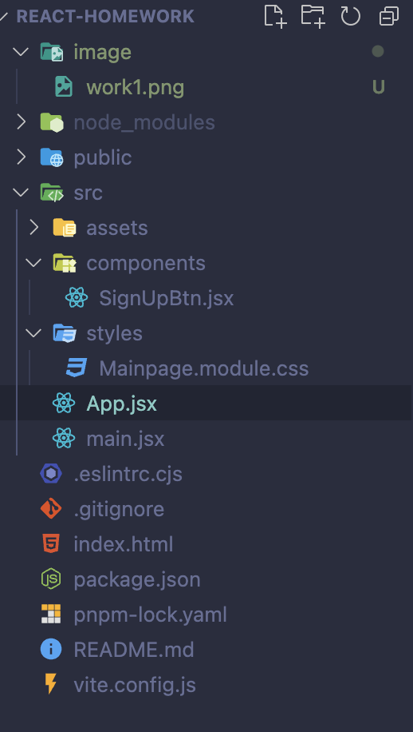

# 멋쟁이 사자처럼 리액트 과제 1

## 1. Figma를 사용하여 컴포넌트 제작해보기



피그마로 로그인 버튼을 컴포넌트로 만들었습니다.

## 2. Vite를 사용하여 리액트 환경구성



**pnpm create vite (파일명)**을 사용하여 React환경을 구성하였습니다.

## 3. 코드 구성

```javascript
ReactDOM.createRoot(document.querySelector("#root")).render(
  <React.StrictMode>
    <App />
  </React.StrictMode>
);
```

    main파일에 전체적인 가상돔을 렌더링하도록 하였습니다.

```javascript
function App() {
  return (
    <div className={style.container}>
      <h1 className={style.title}>리액트 아토믹 컴포넌트 구현하기</h1>
      <SignUpBtn status="click" />
      <SignUpBtn status="white" />
    </div>
  );
}

export default App;
```

후 SignUpBtn파일을 렌더링하도록 구성하였고, 각 status라는 props를 매개변수로 넣었습니다.

```javascript
function SignUpBtn({ status }) {
  const handleColorChange = (e) => {
    const span = document.querySelector(".info");
    e.target.style.backgroundColor = "white";
    e.target.style.border = "2px solid #5F0080";
    span.style.color = "#5F0080";
  };

  return (
    <div
      className={status === "click" ? style.btn : style.whiteBtn}
      onClick={handleColorChange}
    >
      <span className="info">회원가입</span>
    </div>
  );
}
```

이벤트 함수와 조건식을 이용하여 구성하였습니다.
